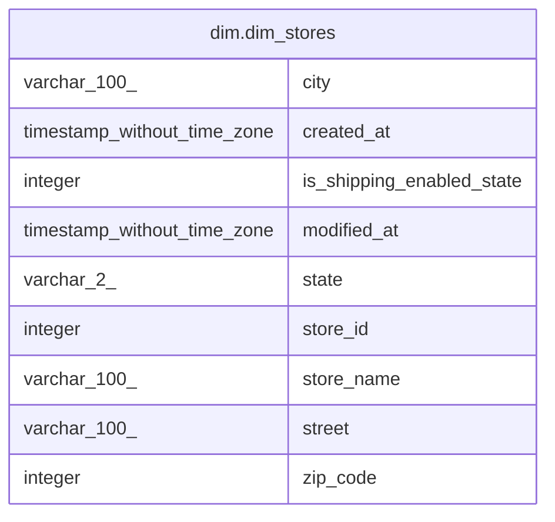

# dim.dim_stores

## Description

## Columns

| # | Name                      | Type                        | Default | Nullable | Children | Parents | Comment |
| - | ------------------------- | --------------------------- | ------- | -------- | -------- | ------- | ------- |
| 1 | city                      | varchar(100)                |         | true     |          |         |         |
| 2 | created_at                | timestamp without time zone |         | true     |          |         |         |
| 3 | is_shipping_enabled_state | integer                     |         | true     |          |         |         |
| 4 | modified_at               | timestamp without time zone |         | true     |          |         |         |
| 5 | state                     | varchar(2)                  |         | true     |          |         |         |
| 6 | store_id                  | integer                     |         | true     |          |         |         |
| 7 | store_name                | varchar(100)                |         | true     |          |         |         |
| 8 | street                    | varchar(100)                |         | true     |          |         |         |
| 9 | zip_code                  | integer                     |         | true     |          |         |         |

## Relations

---

> Generated by [tbls](https://github.com/k1LoW/tbls)
