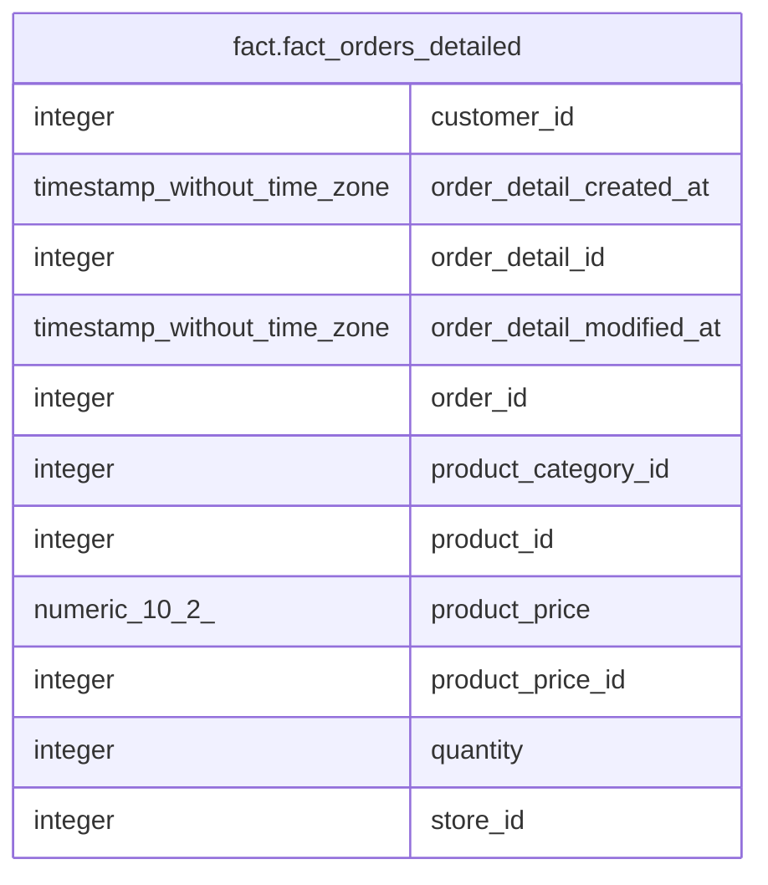

# fact.fact_orders_detailed

## Description

## Columns

| #  | Name                     | Type                        | Default | Nullable | Children | Parents | Comment |
| -- | ------------------------ | --------------------------- | ------- | -------- | -------- | ------- | ------- |
| 1  | customer_id              | integer                     |         | true     |          |         |         |
| 2  | order_detail_created_at  | timestamp without time zone |         | true     |          |         |         |
| 3  | order_detail_id          | integer                     |         | true     |          |         |         |
| 4  | order_detail_modified_at | timestamp without time zone |         | true     |          |         |         |
| 5  | order_id                 | integer                     |         | true     |          |         |         |
| 6  | product_category_id      | integer                     |         | true     |          |         |         |
| 7  | product_id               | integer                     |         | true     |          |         |         |
| 8  | product_price            | numeric(10,2)               |         | true     |          |         |         |
| 9  | product_price_id         | integer                     |         | true     |          |         |         |
| 10 | quantity                 | integer                     |         | true     |          |         |         |
| 11 | store_id                 | integer                     |         | true     |          |         |         |

## Relations

---

> Generated by [tbls](https://github.com/k1LoW/tbls)
