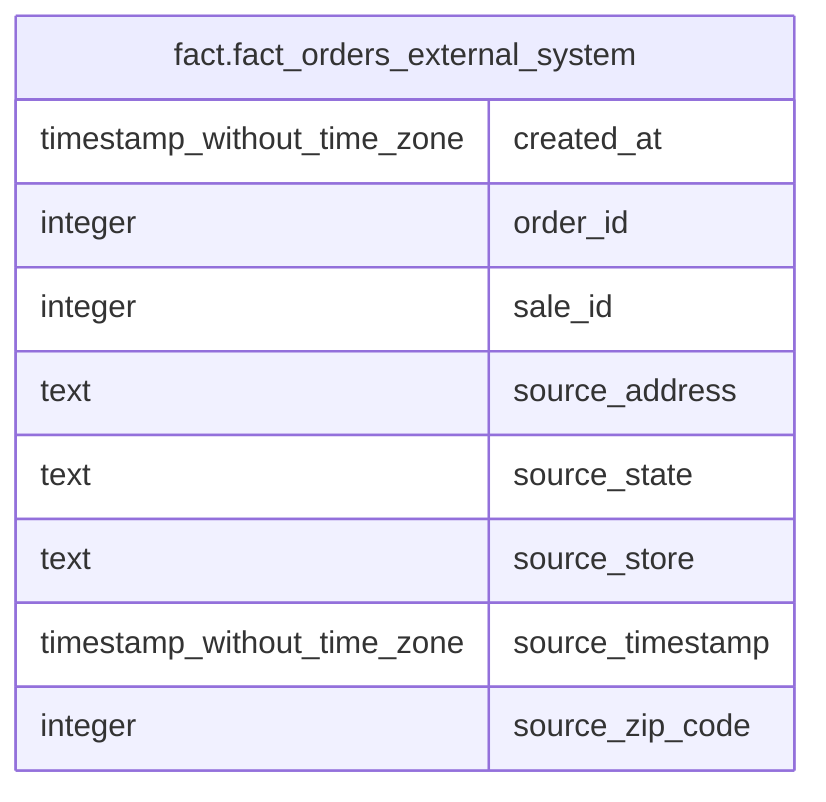

# fact.fact_orders_external_system

## Description

## Columns

| # | Name             | Type                        | Default | Nullable | Children | Parents | Comment |
| - | ---------------- | --------------------------- | ------- | -------- | -------- | ------- | ------- |
| 1 | created_at       | timestamp without time zone |         | true     |          |         |         |
| 2 | order_id         | integer                     |         | true     |          |         |         |
| 3 | sale_id          | integer                     |         | true     |          |         |         |
| 4 | source_address   | text                        |         | true     |          |         |         |
| 5 | source_state     | text                        |         | true     |          |         |         |
| 6 | source_store     | text                        |         | true     |          |         |         |
| 7 | source_timestamp | timestamp without time zone |         | true     |          |         |         |
| 8 | source_zip_code  | integer                     |         | true     |          |         |         |

## Relations

---

> Generated by [tbls](https://github.com/k1LoW/tbls)
