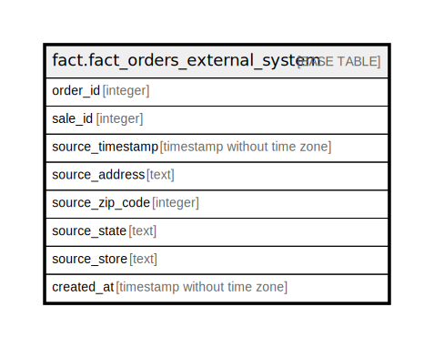

# fact.fact_orders_external_system

## Description

## Columns

| Name | Type | Default | Nullable | Children | Parents | Comment |
| ---- | ---- | ------- | -------- | -------- | ------- | ------- |
| order_id | integer |  | true |  |  |  |
| sale_id | integer |  | true |  |  |  |
| source_timestamp | timestamp without time zone |  | true |  |  |  |
| source_address | text |  | true |  |  |  |
| source_zip_code | integer |  | true |  |  |  |
| source_state | text |  | true |  |  |  |
| source_store | text |  | true |  |  |  |
| created_at | timestamp without time zone |  | true |  |  |  |

## Relations

---

> Generated by [tbls](https://github.com/k1LoW/tbls)
