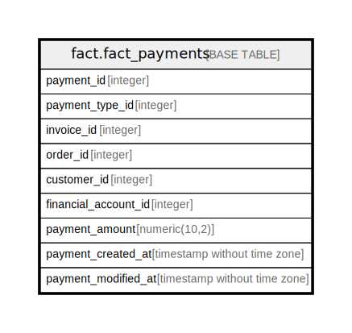

# fact.fact_payments

## Description

## Columns

| Name | Type | Default | Nullable | Children | Parents | Comment |
| ---- | ---- | ------- | -------- | -------- | ------- | ------- |
| payment_id | integer |  | true |  |  |  |
| payment_type_id | integer |  | true |  |  |  |
| invoice_id | integer |  | true |  |  |  |
| order_id | integer |  | true |  |  |  |
| customer_id | integer |  | true |  |  |  |
| financial_account_id | integer |  | true |  |  |  |
| payment_amount | numeric(10,2) |  | true |  |  |  |
| payment_created_at | timestamp without time zone |  | true |  |  |  |
| payment_modified_at | timestamp without time zone |  | true |  |  |  |

## Relations

---

> Generated by [tbls](https://github.com/k1LoW/tbls)
