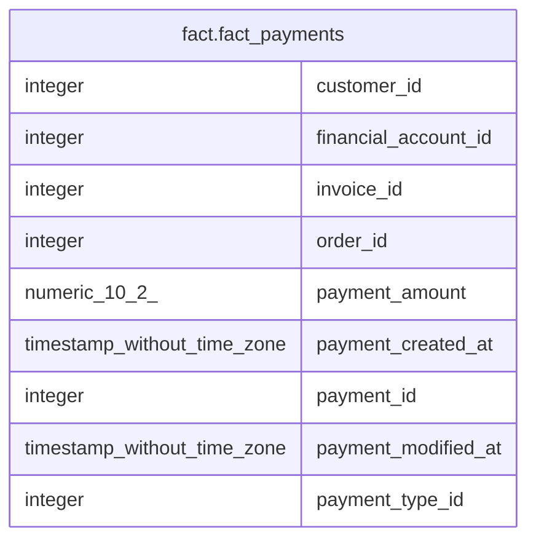

# fact.fact_payments

## Description

## Columns

| # | Name                 | Type                        | Default | Nullable | Children | Parents | Comment |
| - | -------------------- | --------------------------- | ------- | -------- | -------- | ------- | ------- |
| 1 | customer_id          | integer                     |         | true     |          |         |         |
| 2 | financial_account_id | integer                     |         | true     |          |         |         |
| 3 | invoice_id           | integer                     |         | true     |          |         |         |
| 4 | order_id             | integer                     |         | true     |          |         |         |
| 5 | payment_amount       | numeric(10,2)               |         | true     |          |         |         |
| 6 | payment_created_at   | timestamp without time zone |         | true     |          |         |         |
| 7 | payment_id           | integer                     |         | true     |          |         |         |
| 8 | payment_modified_at  | timestamp without time zone |         | true     |          |         |         |
| 9 | payment_type_id      | integer                     |         | true     |          |         |         |

## Relations

---

> Generated by [tbls](https://github.com/k1LoW/tbls)
