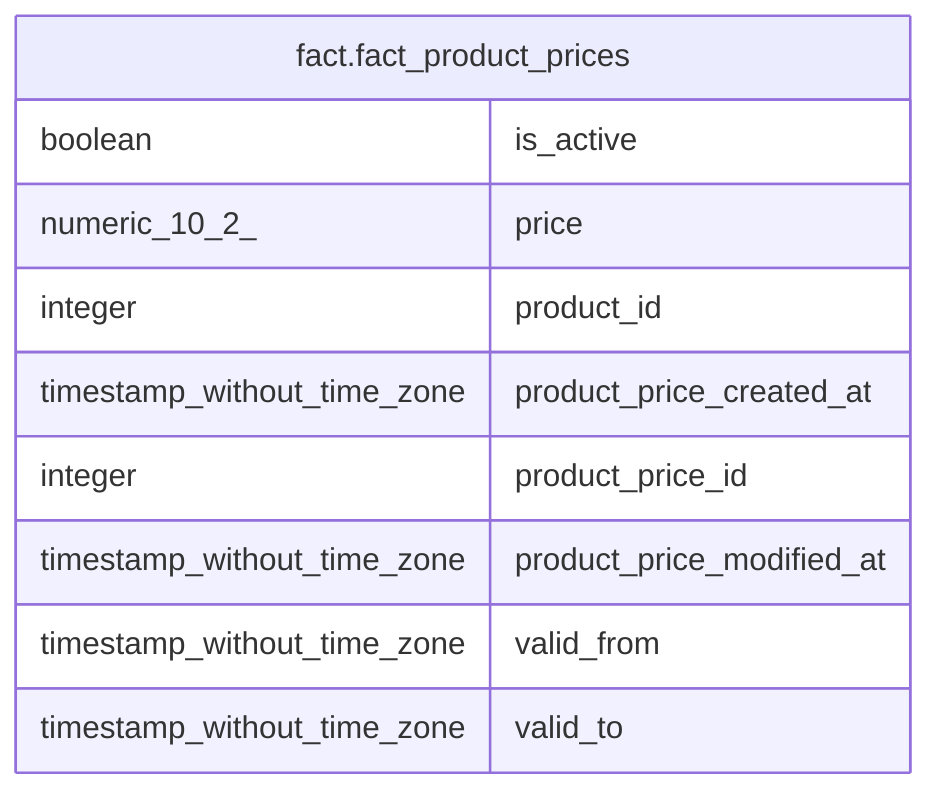

# fact.fact_product_prices

## Description

## Columns

| # | Name                      | Type                        | Default | Nullable | Children | Parents | Comment |
| - | ------------------------- | --------------------------- | ------- | -------- | -------- | ------- | ------- |
| 1 | is_active                 | boolean                     |         | true     |          |         |         |
| 2 | price                     | numeric(10,2)               |         | true     |          |         |         |
| 3 | product_id                | integer                     |         | true     |          |         |         |
| 4 | product_price_created_at  | timestamp without time zone |         | true     |          |         |         |
| 5 | product_price_id          | integer                     |         | true     |          |         |         |
| 6 | product_price_modified_at | timestamp without time zone |         | true     |          |         |         |
| 7 | valid_from                | timestamp without time zone |         | true     |          |         |         |
| 8 | valid_to                  | timestamp without time zone |         | true     |          |         |         |

## Relations

---

> Generated by [tbls](https://github.com/k1LoW/tbls)
