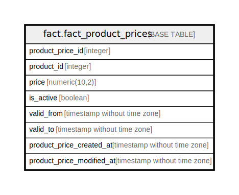

# fact.fact_product_prices

## Description

## Columns

| Name | Type | Default | Nullable | Children | Parents | Comment |
| ---- | ---- | ------- | -------- | -------- | ------- | ------- |
| product_price_id | integer |  | true |  |  |  |
| product_id | integer |  | true |  |  |  |
| price | numeric(10,2) |  | true |  |  |  |
| is_active | boolean |  | true |  |  |  |
| valid_from | timestamp without time zone |  | true |  |  |  |
| valid_to | timestamp without time zone |  | true |  |  |  |
| product_price_created_at | timestamp without time zone |  | true |  |  |  |
| product_price_modified_at | timestamp without time zone |  | true |  |  |  |

## Relations

---

> Generated by [tbls](https://github.com/k1LoW/tbls)
