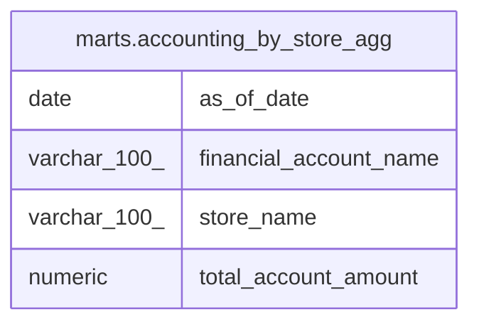

# marts.accounting_by_store_agg

## Description

## Columns

| # | Name                   | Type         | Default | Nullable | Children | Parents | Comment |
| - | ---------------------- | ------------ | ------- | -------- | -------- | ------- | ------- |
| 1 | as_of_date             | date         |         | true     |          |         |         |
| 2 | financial_account_name | varchar(100) |         | true     |          |         |         |
| 3 | store_name             | varchar(100) |         | true     |          |         |         |
| 4 | total_account_amount   | numeric      |         | true     |          |         |         |

## Relations

---

> Generated by [tbls](https://github.com/k1LoW/tbls)
