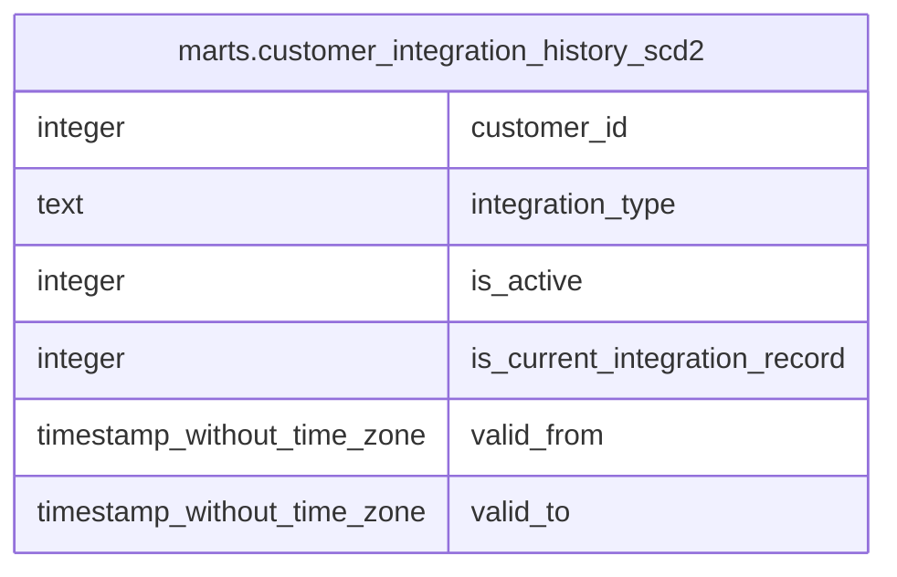

# marts.customer_integration_history_scd2

## Description

## Columns

| # | Name                          | Type                        | Default | Nullable | Children | Parents | Comment |
| - | ----------------------------- | --------------------------- | ------- | -------- | -------- | ------- | ------- |
| 1 | customer_id                   | integer                     |         | true     |          |         |         |
| 2 | integration_type              | text                        |         | true     |          |         |         |
| 3 | is_active                     | integer                     |         | true     |          |         |         |
| 4 | is_current_integration_record | integer                     |         | true     |          |         |         |
| 5 | valid_from                    | timestamp without time zone |         | true     |          |         |         |
| 6 | valid_to                      | timestamp without time zone |         | true     |          |         |         |

## Relations

---

> Generated by [tbls](https://github.com/k1LoW/tbls)
