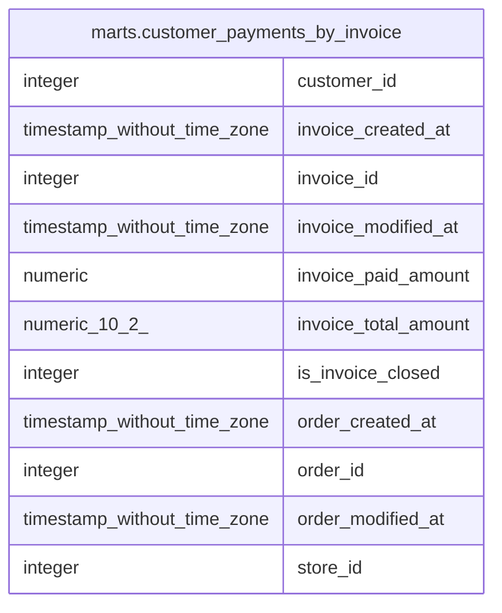

# marts.customer_payments_by_invoice

## Description

## Columns

| #  | Name                 | Type                        | Default | Nullable | Children | Parents | Comment |
| -- | -------------------- | --------------------------- | ------- | -------- | -------- | ------- | ------- |
| 1  | customer_id          | integer                     |         | true     |          |         |         |
| 2  | invoice_created_at   | timestamp without time zone |         | true     |          |         |         |
| 3  | invoice_id           | integer                     |         | true     |          |         |         |
| 4  | invoice_modified_at  | timestamp without time zone |         | true     |          |         |         |
| 5  | invoice_paid_amount  | numeric                     |         | true     |          |         |         |
| 6  | invoice_total_amount | numeric(10,2)               |         | true     |          |         |         |
| 7  | is_invoice_closed    | integer                     |         | true     |          |         |         |
| 8  | order_created_at     | timestamp without time zone |         | true     |          |         |         |
| 9  | order_id             | integer                     |         | true     |          |         |         |
| 10 | order_modified_at    | timestamp without time zone |         | true     |          |         |         |
| 11 | store_id             | integer                     |         | true     |          |         |         |

## Relations

---

> Generated by [tbls](https://github.com/k1LoW/tbls)
