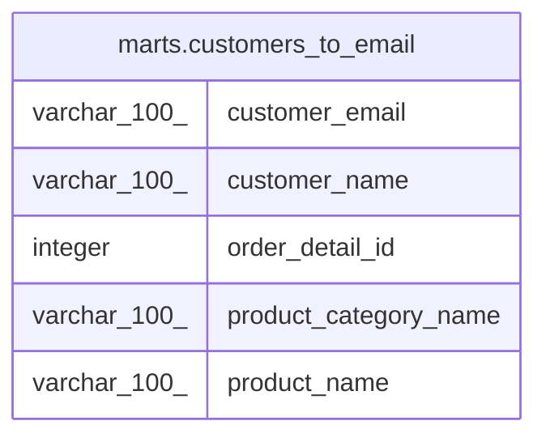

# marts.customers_to_email

## Description

## Columns

| # | Name                  | Type         | Default | Nullable | Children | Parents | Comment |
| - | --------------------- | ------------ | ------- | -------- | -------- | ------- | ------- |
| 1 | customer_email        | varchar(100) |         | true     |          |         |         |
| 2 | customer_name         | varchar(100) |         | true     |          |         |         |
| 3 | order_detail_id       | integer      |         | true     |          |         |         |
| 4 | product_category_name | varchar(100) |         | true     |          |         |         |
| 5 | product_name          | varchar(100) |         | true     |          |         |         |

## Relations

---

> Generated by [tbls](https://github.com/k1LoW/tbls)
