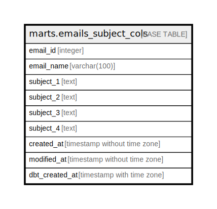

# marts.emails_subject_cols

## Description

## Columns

| Name | Type | Default | Nullable | Children | Parents | Comment |
| ---- | ---- | ------- | -------- | -------- | ------- | ------- |
| email_id | integer |  | true |  |  |  |
| email_name | varchar(100) |  | true |  |  |  |
| subject_1 | text |  | true |  |  |  |
| subject_2 | text |  | true |  |  |  |
| subject_3 | text |  | true |  |  |  |
| subject_4 | text |  | true |  |  |  |
| created_at | timestamp without time zone |  | true |  |  |  |
| modified_at | timestamp without time zone |  | true |  |  |  |
| dbt_created_at | timestamp with time zone |  | true |  |  |  |

## Relations

---

> Generated by [tbls](https://github.com/k1LoW/tbls)
