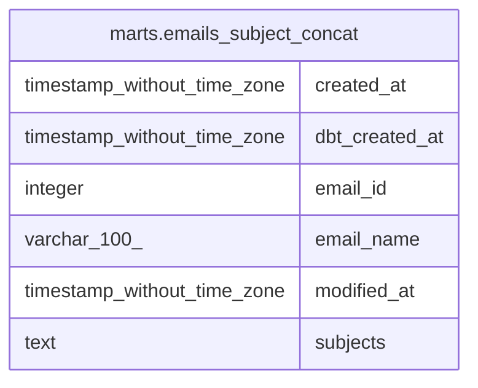

# marts.emails_subject_concat

## Description

## Columns

| # | Name           | Type                        | Default | Nullable | Children | Parents | Comment |
| - | -------------- | --------------------------- | ------- | -------- | -------- | ------- | ------- |
| 1 | created_at     | timestamp without time zone |         | true     |          |         |         |
| 2 | dbt_created_at | timestamp without time zone |         | true     |          |         |         |
| 3 | email_id       | integer                     |         | true     |          |         |         |
| 4 | email_name     | varchar(100)                |         | true     |          |         |         |
| 5 | modified_at    | timestamp without time zone |         | true     |          |         |         |
| 6 | subjects       | text                        |         | true     |          |         |         |

## Relations

---

> Generated by [tbls](https://github.com/k1LoW/tbls)
