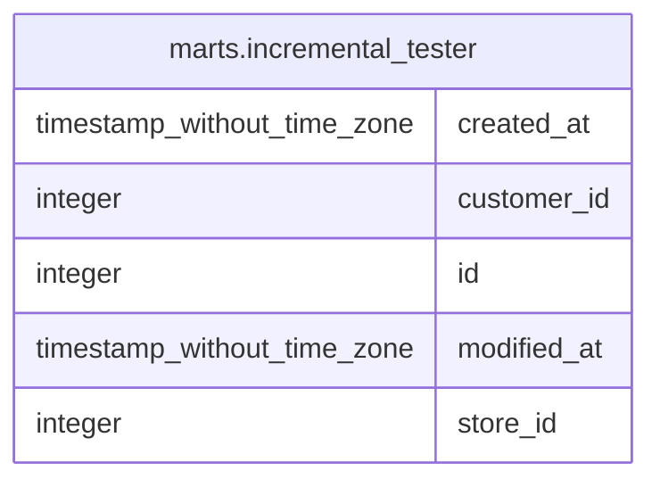

# marts.incremental_tester

## Description

## Columns

| # | Name        | Type                        | Default | Nullable | Children | Parents | Comment |
| - | ----------- | --------------------------- | ------- | -------- | -------- | ------- | ------- |
| 1 | created_at  | timestamp without time zone |         | true     |          |         |         |
| 2 | customer_id | integer                     |         | true     |          |         |         |
| 3 | id          | integer                     |         | true     |          |         |         |
| 4 | modified_at | timestamp without time zone |         | true     |          |         |         |
| 5 | store_id    | integer                     |         | true     |          |         |         |

## Relations

---

> Generated by [tbls](https://github.com/k1LoW/tbls)
