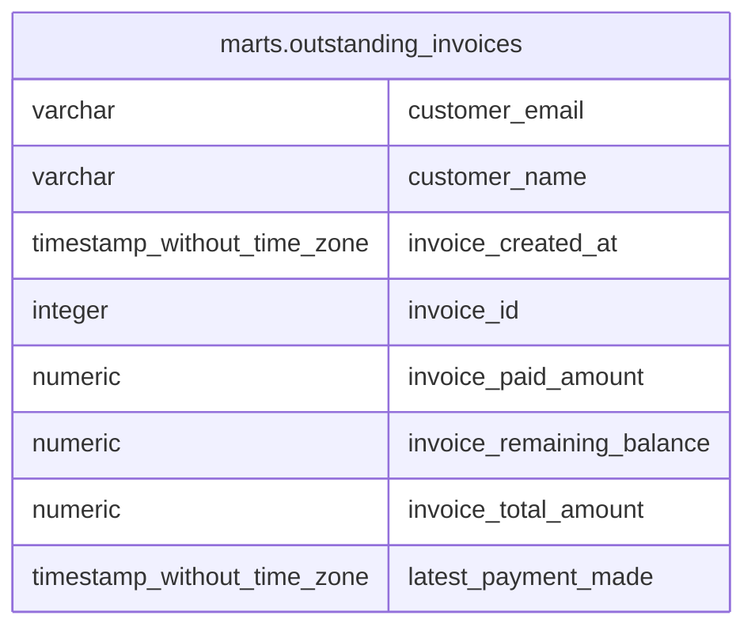

# marts.outstanding_invoices

## Description

## Columns

| # | Name                      | Type                        | Default | Nullable | Children | Parents | Comment |
| - | ------------------------- | --------------------------- | ------- | -------- | -------- | ------- | ------- |
| 1 | customer_email            | varchar                     |         | true     |          |         |         |
| 2 | customer_name             | varchar                     |         | true     |          |         |         |
| 3 | invoice_created_at        | timestamp without time zone |         | true     |          |         |         |
| 4 | invoice_id                | integer                     |         | true     |          |         |         |
| 5 | invoice_paid_amount       | numeric                     |         | true     |          |         |         |
| 6 | invoice_remaining_balance | numeric                     |         | true     |          |         |         |
| 7 | invoice_total_amount      | numeric                     |         | true     |          |         |         |
| 8 | latest_payment_made       | timestamp without time zone |         | true     |          |         |         |

## Relations

---

> Generated by [tbls](https://github.com/k1LoW/tbls)
