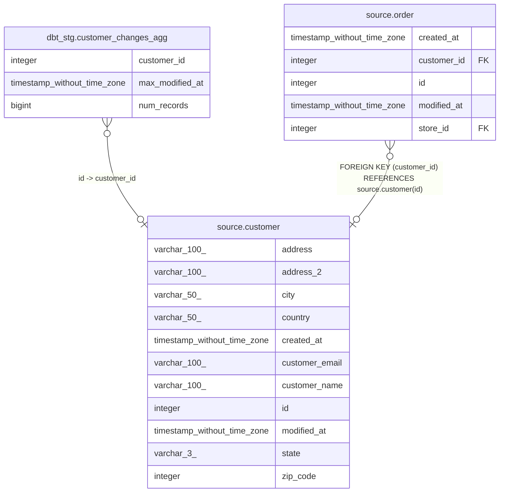

# source.customer

## Description

## Columns

| #  | Name           | Type                        | Default                                     | Nullable | Children                                                                                        | Parents | Comment |
| -- | -------------- | --------------------------- | ------------------------------------------- | -------- | ----------------------------------------------------------------------------------------------- | ------- | ------- |
| 1  | address        | varchar(100)                |                                             | true     |                                                                                                 |         |         |
| 2  | address_2      | varchar(100)                |                                             | true     |                                                                                                 |         |         |
| 3  | city           | varchar(50)                 |                                             | true     |                                                                                                 |         |         |
| 4  | country        | varchar(50)                 |                                             | true     |                                                                                                 |         |         |
| 5  | created_at     | timestamp without time zone | CURRENT_TIMESTAMP                           | true     |                                                                                                 |         |         |
| 6  | customer_email | varchar(100)                |                                             | true     |                                                                                                 |         |         |
| 7  | customer_name  | varchar(100)                |                                             | true     |                                                                                                 |         |         |
| 8  | id             | integer                     | nextval('source.customer_id_seq'::regclass) | false    | [dbt_stg.customer_changes_agg](dbt_stg.customer_changes_agg.md) [source.order](source.order.md) |         |         |
| 9  | modified_at    | timestamp without time zone | CURRENT_TIMESTAMP                           | true     |                                                                                                 |         |         |
| 10 | state          | varchar(3)                  |                                             | true     |                                                                                                 |         |         |
| 11 | zip_code       | integer                     |                                             | true     |                                                                                                 |         |         |

## Constraints

| # | Name          | Type        | Definition       |
| - | ------------- | ----------- | ---------------- |
| 1 | customer_pkey | PRIMARY KEY | PRIMARY KEY (id) |

## Indexes

| # | Name          | Definition                                                            |
| - | ------------- | --------------------------------------------------------------------- |
| 1 | customer_pkey | CREATE UNIQUE INDEX customer_pkey ON source.customer USING btree (id) |

## Relations

---

> Generated by [tbls](https://github.com/k1LoW/tbls)
