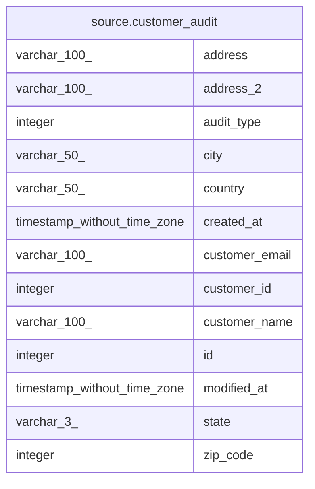

# source.customer_audit

## Description

## Columns

| #  | Name           | Type                        | Default                                           | Nullable | Children | Parents | Comment |
| -- | -------------- | --------------------------- | ------------------------------------------------- | -------- | -------- | ------- | ------- |
| 1  | address        | varchar(100)                |                                                   | true     |          |         |         |
| 2  | address_2      | varchar(100)                |                                                   | true     |          |         |         |
| 3  | audit_type     | integer                     |                                                   | true     |          |         |         |
| 4  | city           | varchar(50)                 |                                                   | true     |          |         |         |
| 5  | country        | varchar(50)                 |                                                   | true     |          |         |         |
| 6  | created_at     | timestamp without time zone | CURRENT_TIMESTAMP                                 | true     |          |         |         |
| 7  | customer_email | varchar(100)                |                                                   | true     |          |         |         |
| 8  | customer_id    | integer                     |                                                   | true     |          |         |         |
| 9  | customer_name  | varchar(100)                |                                                   | true     |          |         |         |
| 10 | id             | integer                     | nextval('source.customer_audit_id_seq'::regclass) | false    |          |         |         |
| 11 | modified_at    | timestamp without time zone | CURRENT_TIMESTAMP                                 | true     |          |         |         |
| 12 | state          | varchar(3)                  |                                                   | true     |          |         |         |
| 13 | zip_code       | integer                     |                                                   | true     |          |         |         |

## Constraints

| # | Name                | Type        | Definition       |
| - | ------------------- | ----------- | ---------------- |
| 1 | customer_audit_pkey | PRIMARY KEY | PRIMARY KEY (id) |

## Indexes

| # | Name                | Definition                                                                        |
| - | ------------------- | --------------------------------------------------------------------------------- |
| 1 | customer_audit_pkey | CREATE UNIQUE INDEX customer_audit_pkey ON source.customer_audit USING btree (id) |

## Relations

---

> Generated by [tbls](https://github.com/k1LoW/tbls)
