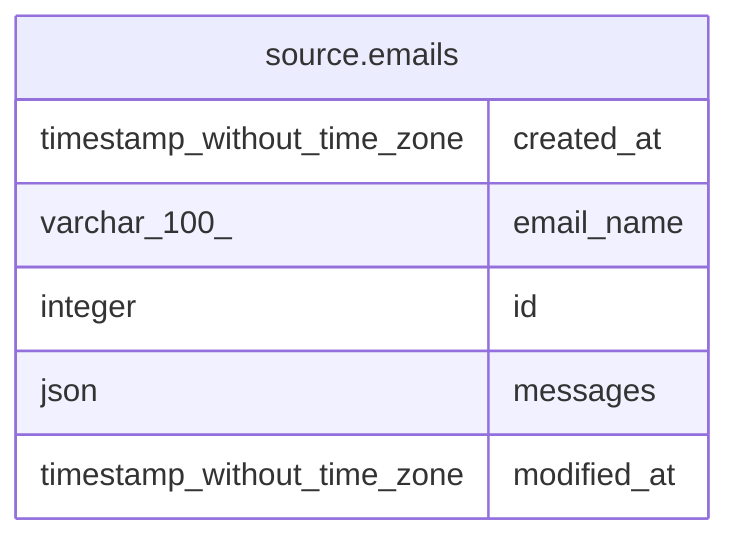

# source.emails

## Description

## Columns

| # | Name        | Type                        | Default                                   | Nullable | Children | Parents | Comment |
| - | ----------- | --------------------------- | ----------------------------------------- | -------- | -------- | ------- | ------- |
| 1 | created_at  | timestamp without time zone | CURRENT_TIMESTAMP                         | true     |          |         |         |
| 2 | email_name  | varchar(100)                |                                           | true     |          |         |         |
| 3 | id          | integer                     | nextval('source.emails_id_seq'::regclass) | false    |          |         |         |
| 4 | messages    | json                        |                                           | true     |          |         |         |
| 5 | modified_at | timestamp without time zone | CURRENT_TIMESTAMP                         | true     |          |         |         |

## Constraints

| # | Name        | Type        | Definition       |
| - | ----------- | ----------- | ---------------- |
| 1 | emails_pkey | PRIMARY KEY | PRIMARY KEY (id) |

## Indexes

| # | Name        | Definition                                                        |
| - | ----------- | ----------------------------------------------------------------- |
| 1 | emails_pkey | CREATE UNIQUE INDEX emails_pkey ON source.emails USING btree (id) |

## Relations

---

> Generated by [tbls](https://github.com/k1LoW/tbls)
