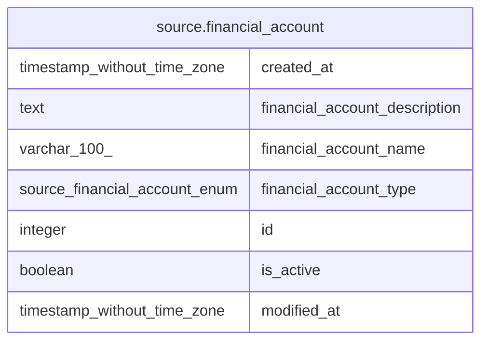

# source.financial_account

## Description

## Columns

| # | Name                          | Type                          | Default                                              | Nullable | Children | Parents | Comment |
| - | ----------------------------- | ----------------------------- | ---------------------------------------------------- | -------- | -------- | ------- | ------- |
| 1 | created_at                    | timestamp without time zone   | CURRENT_TIMESTAMP                                    | true     |          |         |         |
| 2 | financial_account_description | text                          |                                                      | true     |          |         |         |
| 3 | financial_account_name        | varchar(100)                  |                                                      | false    |          |         |         |
| 4 | financial_account_type        | source.financial_account_enum |                                                      | true     |          |         |         |
| 5 | id                            | integer                       | nextval('source.financial_account_id_seq'::regclass) | false    |          |         |         |
| 6 | is_active                     | boolean                       | true                                                 | true     |          |         |         |
| 7 | modified_at                   | timestamp without time zone   | CURRENT_TIMESTAMP                                    | true     |          |         |         |

## Constraints

| # | Name                   | Type        | Definition       |
| - | ---------------------- | ----------- | ---------------- |
| 1 | financial_account_pkey | PRIMARY KEY | PRIMARY KEY (id) |

## Indexes

| # | Name                   | Definition                                                                              |
| - | ---------------------- | --------------------------------------------------------------------------------------- |
| 1 | financial_account_pkey | CREATE UNIQUE INDEX financial_account_pkey ON source.financial_account USING btree (id) |

## Relations

---

> Generated by [tbls](https://github.com/k1LoW/tbls)
