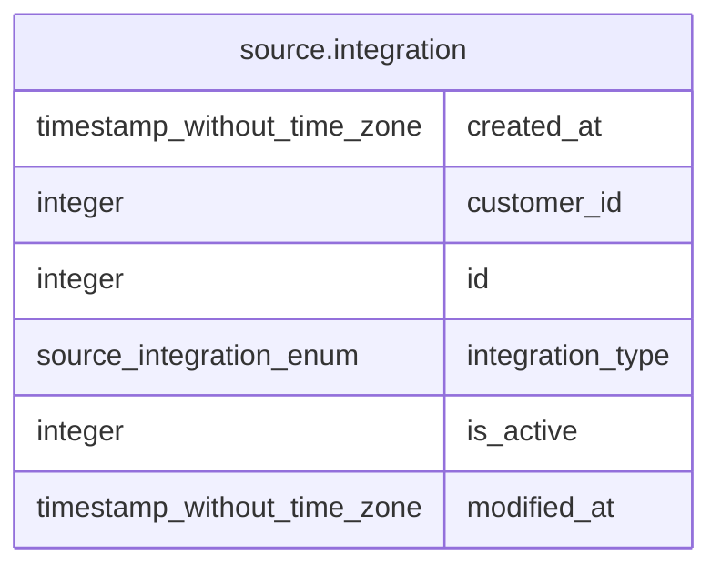

# source.integration

## Description

## Columns

| # | Name             | Type                        | Default                                        | Nullable | Children | Parents | Comment |
| - | ---------------- | --------------------------- | ---------------------------------------------- | -------- | -------- | ------- | ------- |
| 1 | created_at       | timestamp without time zone | CURRENT_TIMESTAMP                              | true     |          |         |         |
| 2 | customer_id      | integer                     |                                                | true     |          |         |         |
| 3 | id               | integer                     | nextval('source.integration_id_seq'::regclass) | false    |          |         |         |
| 4 | integration_type | source.integration_enum     |                                                | true     |          |         |         |
| 5 | is_active        | integer                     |                                                | true     |          |         |         |
| 6 | modified_at      | timestamp without time zone | CURRENT_TIMESTAMP                              | true     |          |         |         |

## Constraints

| # | Name             | Type        | Definition       |
| - | ---------------- | ----------- | ---------------- |
| 1 | integration_pkey | PRIMARY KEY | PRIMARY KEY (id) |

## Indexes

| # | Name             | Definition                                                                  |
| - | ---------------- | --------------------------------------------------------------------------- |
| 1 | integration_pkey | CREATE UNIQUE INDEX integration_pkey ON source.integration USING btree (id) |

## Relations

---

> Generated by [tbls](https://github.com/k1LoW/tbls)
