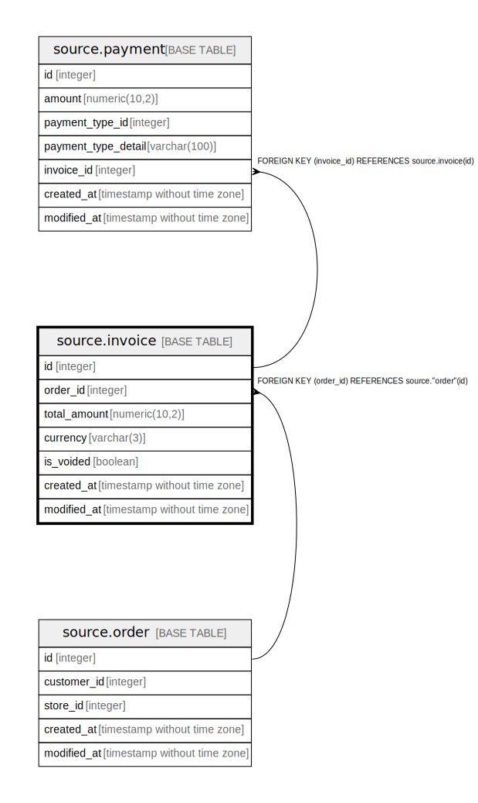

# source.invoice

## Description

## Columns

| Name | Type | Default | Nullable | Children | Parents | Comment |
| ---- | ---- | ------- | -------- | -------- | ------- | ------- |
| id | integer | nextval('source.invoice_id_seq'::regclass) | false | [source.payment](source.payment.md) |  |  |
| order_id | integer |  | true |  | [source.order](source.order.md) |  |
| total_amount | numeric(10,2) |  | false |  |  |  |
| currency | varchar(3) | 'USD'::character varying | true |  |  |  |
| is_voided | boolean | false | true |  |  |  |
| created_at | timestamp without time zone | CURRENT_TIMESTAMP | true |  |  |  |
| modified_at | timestamp without time zone | CURRENT_TIMESTAMP | true |  |  |  |

## Constraints

| Name | Type | Definition |
| ---- | ---- | ---------- |
| fk_order_id | FOREIGN KEY | FOREIGN KEY (order_id) REFERENCES source."order"(id) |
| invoice_pkey | PRIMARY KEY | PRIMARY KEY (id) |

## Indexes

| Name | Definition |
| ---- | ---------- |
| invoice_pkey | CREATE UNIQUE INDEX invoice_pkey ON source.invoice USING btree (id) |

## Relations

---

> Generated by [tbls](https://github.com/k1LoW/tbls)
