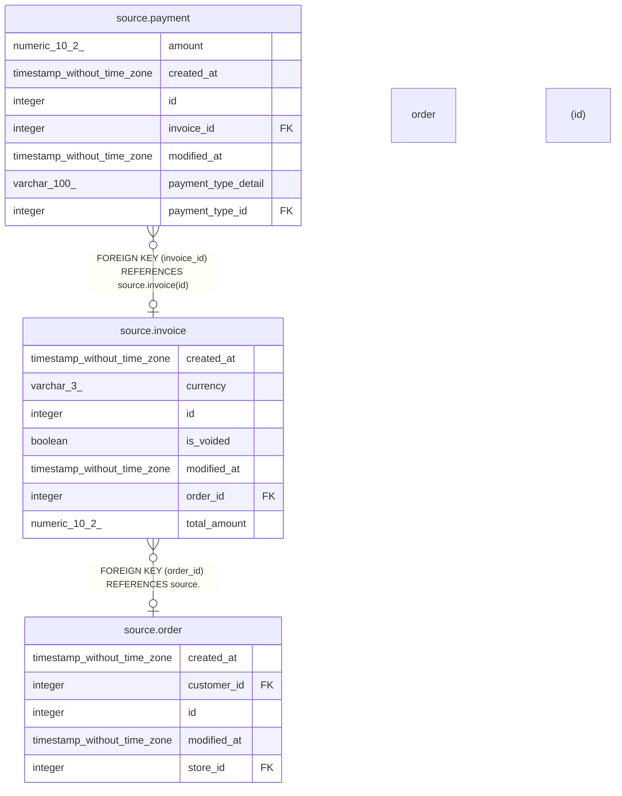

# source.invoice

## Description

## Columns

| # | Name         | Type                        | Default                                    | Nullable | Children                            | Parents                         | Comment |
| - | ------------ | --------------------------- | ------------------------------------------ | -------- | ----------------------------------- | ------------------------------- | ------- |
| 1 | created_at   | timestamp without time zone | CURRENT_TIMESTAMP                          | true     |                                     |                                 |         |
| 2 | currency     | varchar(3)                  | 'USD'::character varying                   | true     |                                     |                                 |         |
| 3 | id           | integer                     | nextval('source.invoice_id_seq'::regclass) | false    | [source.payment](source.payment.md) |                                 |         |
| 4 | is_voided    | boolean                     | false                                      | true     |                                     |                                 |         |
| 5 | modified_at  | timestamp without time zone | CURRENT_TIMESTAMP                          | true     |                                     |                                 |         |
| 6 | order_id     | integer                     |                                            | true     |                                     | [source.order](source.order.md) |         |
| 7 | total_amount | numeric(10,2)               |                                            | false    |                                     |                                 |         |

## Constraints

| # | Name         | Type        | Definition                                           |
| - | ------------ | ----------- | ---------------------------------------------------- |
| 1 | fk_order_id  | FOREIGN KEY | FOREIGN KEY (order_id) REFERENCES source."order"(id) |
| 2 | invoice_pkey | PRIMARY KEY | PRIMARY KEY (id)                                     |

## Indexes

| # | Name         | Definition                                                          |
| - | ------------ | ------------------------------------------------------------------- |
| 1 | invoice_pkey | CREATE UNIQUE INDEX invoice_pkey ON source.invoice USING btree (id) |

## Relations

---

> Generated by [tbls](https://github.com/k1LoW/tbls)
