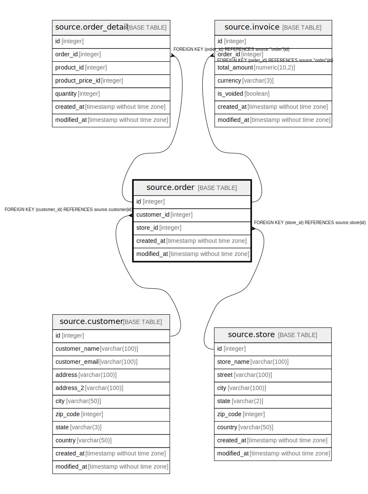

# source.order

## Description

## Columns

| Name | Type | Default | Nullable | Children | Parents | Comment |
| ---- | ---- | ------- | -------- | -------- | ------- | ------- |
| id | integer | nextval('source.order_id_seq'::regclass) | false | [source.order_detail](source.order_detail.md) [source.invoice](source.invoice.md) |  |  |
| customer_id | integer |  | true |  | [source.customer](source.customer.md) |  |
| store_id | integer |  | true |  | [source.store](source.store.md) |  |
| created_at | timestamp without time zone | CURRENT_TIMESTAMP | true |  |  |  |
| modified_at | timestamp without time zone | CURRENT_TIMESTAMP | true |  |  |  |

## Constraints

| Name | Type | Definition |
| ---- | ---- | ---------- |
| fk_customer_id | FOREIGN KEY | FOREIGN KEY (customer_id) REFERENCES source.customer(id) |
| fk_store_id | FOREIGN KEY | FOREIGN KEY (store_id) REFERENCES source.store(id) |
| order_pkey | PRIMARY KEY | PRIMARY KEY (id) |

## Indexes

| Name | Definition |
| ---- | ---------- |
| order_pkey | CREATE UNIQUE INDEX order_pkey ON source."order" USING btree (id) |

## Relations

---

> Generated by [tbls](https://github.com/k1LoW/tbls)
