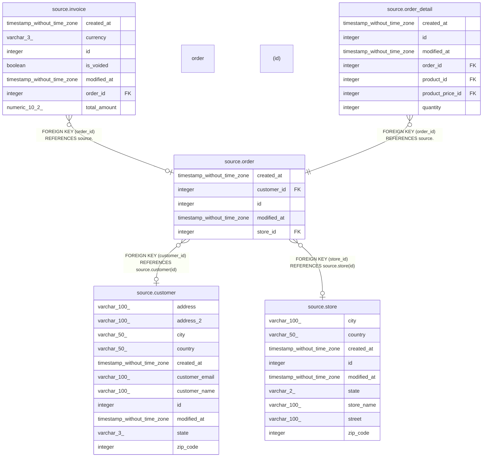

# source.order

## Description

## Columns

| # | Name        | Type                        | Default                                  | Nullable | Children                                                                          | Parents                               | Comment |
| - | ----------- | --------------------------- | ---------------------------------------- | -------- | --------------------------------------------------------------------------------- | ------------------------------------- | ------- |
| 1 | created_at  | timestamp without time zone | CURRENT_TIMESTAMP                        | true     |                                                                                   |                                       |         |
| 2 | customer_id | integer                     |                                          | true     |                                                                                   | [source.customer](source.customer.md) |         |
| 3 | id          | integer                     | nextval('source.order_id_seq'::regclass) | false    | [source.invoice](source.invoice.md) [source.order_detail](source.order_detail.md) |                                       |         |
| 4 | modified_at | timestamp without time zone | CURRENT_TIMESTAMP                        | true     |                                                                                   |                                       |         |
| 5 | store_id    | integer                     |                                          | true     |                                                                                   | [source.store](source.store.md)       |         |

## Constraints

| # | Name           | Type        | Definition                                               |
| - | -------------- | ----------- | -------------------------------------------------------- |
| 1 | fk_customer_id | FOREIGN KEY | FOREIGN KEY (customer_id) REFERENCES source.customer(id) |
| 2 | fk_store_id    | FOREIGN KEY | FOREIGN KEY (store_id) REFERENCES source.store(id)       |
| 3 | order_pkey     | PRIMARY KEY | PRIMARY KEY (id)                                         |

## Indexes

| # | Name       | Definition                                                        |
| - | ---------- | ----------------------------------------------------------------- |
| 1 | order_pkey | CREATE UNIQUE INDEX order_pkey ON source."order" USING btree (id) |

## Relations

---

> Generated by [tbls](https://github.com/k1LoW/tbls)
