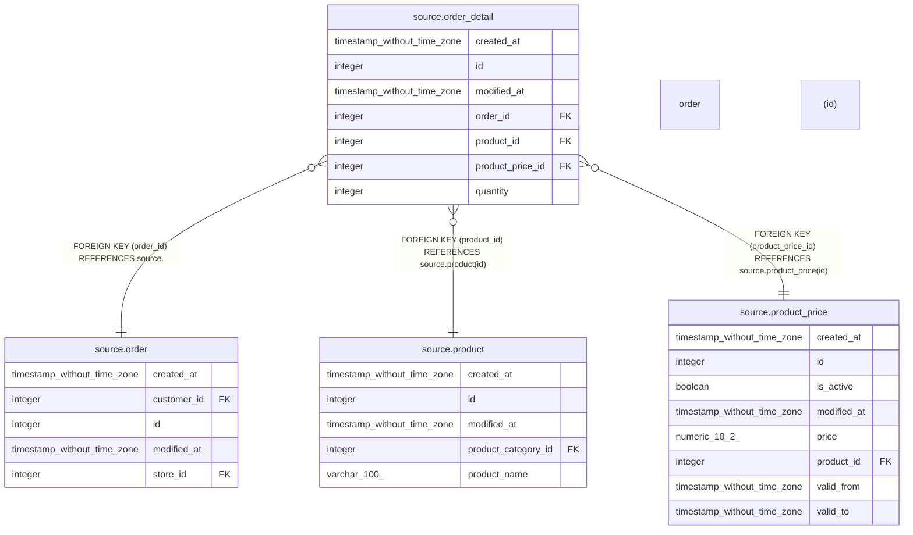

# source.order_detail

## Description

## Columns

| # | Name             | Type                        | Default                                         | Nullable | Children | Parents                                         | Comment |
| - | ---------------- | --------------------------- | ----------------------------------------------- | -------- | -------- | ----------------------------------------------- | ------- |
| 1 | created_at       | timestamp without time zone | CURRENT_TIMESTAMP                               | true     |          |                                                 |         |
| 2 | id               | integer                     | nextval('source.order_detail_id_seq'::regclass) | false    |          |                                                 |         |
| 3 | modified_at      | timestamp without time zone | CURRENT_TIMESTAMP                               | true     |          |                                                 |         |
| 4 | order_id         | integer                     |                                                 | false    |          | [source.order](source.order.md)                 |         |
| 5 | product_id       | integer                     |                                                 | false    |          | [source.product](source.product.md)             |         |
| 6 | product_price_id | integer                     |                                                 | false    |          | [source.product_price](source.product_price.md) |         |
| 7 | quantity         | integer                     |                                                 | false    |          |                                                 |         |

## Constraints

| # | Name                | Type        | Definition                                                         |
| - | ------------------- | ----------- | ------------------------------------------------------------------ |
| 1 | fk_order_id         | FOREIGN KEY | FOREIGN KEY (order_id) REFERENCES source."order"(id)               |
| 2 | fk_product_id       | FOREIGN KEY | FOREIGN KEY (product_id) REFERENCES source.product(id)             |
| 3 | fk_product_price_id | FOREIGN KEY | FOREIGN KEY (product_price_id) REFERENCES source.product_price(id) |
| 4 | order_detail_pkey   | PRIMARY KEY | PRIMARY KEY (id)                                                   |

## Indexes

| # | Name              | Definition                                                                    |
| - | ----------------- | ----------------------------------------------------------------------------- |
| 1 | order_detail_pkey | CREATE UNIQUE INDEX order_detail_pkey ON source.order_detail USING btree (id) |

## Relations

---

> Generated by [tbls](https://github.com/k1LoW/tbls)
