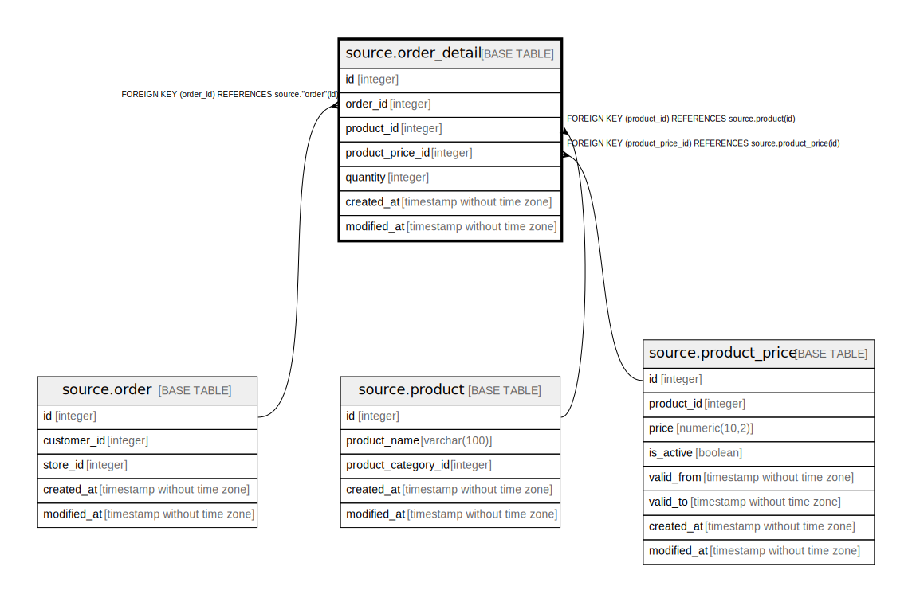

# source.order_detail

## Description

## Columns

| Name | Type | Default | Nullable | Children | Parents | Comment |
| ---- | ---- | ------- | -------- | -------- | ------- | ------- |
| id | integer | nextval('source.order_detail_id_seq'::regclass) | false |  |  |  |
| order_id | integer |  | false |  | [source.order](source.order.md) |  |
| product_id | integer |  | false |  | [source.product](source.product.md) |  |
| product_price_id | integer |  | false |  | [source.product_price](source.product_price.md) |  |
| quantity | integer |  | false |  |  |  |
| created_at | timestamp without time zone | CURRENT_TIMESTAMP | true |  |  |  |
| modified_at | timestamp without time zone | CURRENT_TIMESTAMP | true |  |  |  |

## Constraints

| Name | Type | Definition |
| ---- | ---- | ---------- |
| fk_order_id | FOREIGN KEY | FOREIGN KEY (order_id) REFERENCES source."order"(id) |
| fk_product_id | FOREIGN KEY | FOREIGN KEY (product_id) REFERENCES source.product(id) |
| fk_product_price_id | FOREIGN KEY | FOREIGN KEY (product_price_id) REFERENCES source.product_price(id) |
| order_detail_pkey | PRIMARY KEY | PRIMARY KEY (id) |

## Indexes

| Name | Definition |
| ---- | ---------- |
| order_detail_pkey | CREATE UNIQUE INDEX order_detail_pkey ON source.order_detail USING btree (id) |

## Relations

---

> Generated by [tbls](https://github.com/k1LoW/tbls)
