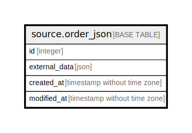

# source.order_json

## Description

## Columns

| Name | Type | Default | Nullable | Children | Parents | Comment |
| ---- | ---- | ------- | -------- | -------- | ------- | ------- |
| id | integer | nextval('source.order_json_id_seq'::regclass) | false |  |  |  |
| external_data | json |  | false |  |  |  |
| created_at | timestamp without time zone | CURRENT_TIMESTAMP | true |  |  |  |
| modified_at | timestamp without time zone | CURRENT_TIMESTAMP | true |  |  |  |

## Constraints

| Name | Type | Definition |
| ---- | ---- | ---------- |
| order_json_pkey | PRIMARY KEY | PRIMARY KEY (id) |

## Indexes

| Name | Definition |
| ---- | ---------- |
| order_json_pkey | CREATE UNIQUE INDEX order_json_pkey ON source.order_json USING btree (id) |

## Relations

---

> Generated by [tbls](https://github.com/k1LoW/tbls)
