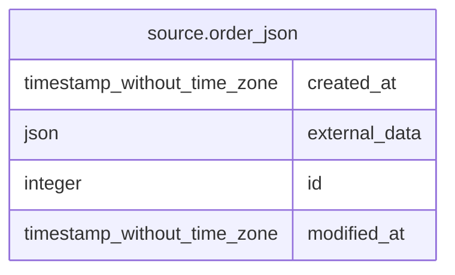

# source.order_json

## Description

## Columns

| # | Name          | Type                        | Default                                       | Nullable | Children | Parents | Comment |
| - | ------------- | --------------------------- | --------------------------------------------- | -------- | -------- | ------- | ------- |
| 1 | created_at    | timestamp without time zone | CURRENT_TIMESTAMP                             | true     |          |         |         |
| 2 | external_data | json                        |                                               | false    |          |         |         |
| 3 | id            | integer                     | nextval('source.order_json_id_seq'::regclass) | false    |          |         |         |
| 4 | modified_at   | timestamp without time zone | CURRENT_TIMESTAMP                             | true     |          |         |         |

## Constraints

| # | Name            | Type        | Definition       |
| - | --------------- | ----------- | ---------------- |
| 1 | order_json_pkey | PRIMARY KEY | PRIMARY KEY (id) |

## Indexes

| # | Name            | Definition                                                                |
| - | --------------- | ------------------------------------------------------------------------- |
| 1 | order_json_pkey | CREATE UNIQUE INDEX order_json_pkey ON source.order_json USING btree (id) |

## Relations

---

> Generated by [tbls](https://github.com/k1LoW/tbls)
