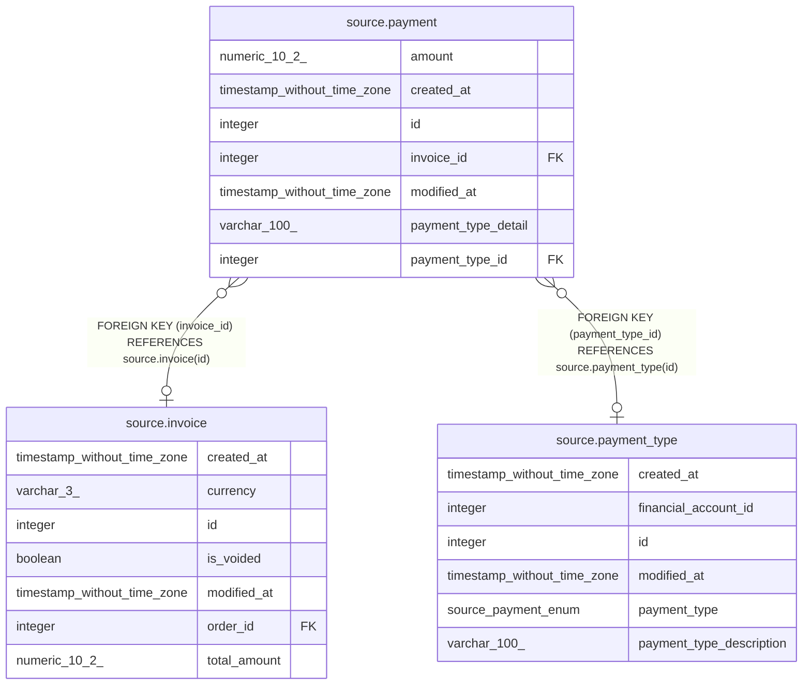

# source.payment

## Description

## Columns

| # | Name                | Type                        | Default                                    | Nullable | Children | Parents                                       | Comment |
| - | ------------------- | --------------------------- | ------------------------------------------ | -------- | -------- | --------------------------------------------- | ------- |
| 1 | amount              | numeric(10,2)               |                                            | true     |          |                                               |         |
| 2 | created_at          | timestamp without time zone | CURRENT_TIMESTAMP                          | true     |          |                                               |         |
| 3 | id                  | integer                     | nextval('source.payment_id_seq'::regclass) | false    |          |                                               |         |
| 4 | invoice_id          | integer                     |                                            | true     |          | [source.invoice](source.invoice.md)           |         |
| 5 | modified_at         | timestamp without time zone | CURRENT_TIMESTAMP                          | true     |          |                                               |         |
| 6 | payment_type_detail | varchar(100)                |                                            | true     |          |                                               |         |
| 7 | payment_type_id     | integer                     |                                            | true     |          | [source.payment_type](source.payment_type.md) |         |

## Constraints

| # | Name               | Type        | Definition                                                       |
| - | ------------------ | ----------- | ---------------------------------------------------------------- |
| 1 | fk_invoice_id      | FOREIGN KEY | FOREIGN KEY (invoice_id) REFERENCES source.invoice(id)           |
| 2 | fk_payment_type_id | FOREIGN KEY | FOREIGN KEY (payment_type_id) REFERENCES source.payment_type(id) |
| 3 | payment_pkey       | PRIMARY KEY | PRIMARY KEY (id)                                                 |

## Indexes

| # | Name         | Definition                                                          |
| - | ------------ | ------------------------------------------------------------------- |
| 1 | payment_pkey | CREATE UNIQUE INDEX payment_pkey ON source.payment USING btree (id) |

## Relations

---

> Generated by [tbls](https://github.com/k1LoW/tbls)
