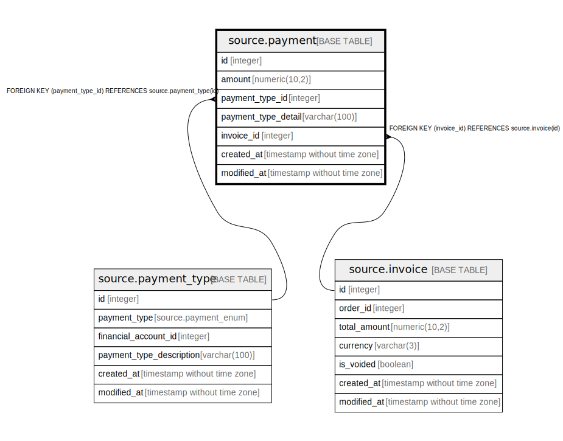

# source.payment

## Description

## Columns

| Name | Type | Default | Nullable | Children | Parents | Comment |
| ---- | ---- | ------- | -------- | -------- | ------- | ------- |
| id | integer | nextval('source.payment_id_seq'::regclass) | false |  |  |  |
| amount | numeric(10,2) |  | true |  |  |  |
| payment_type_id | integer |  | true |  | [source.payment_type](source.payment_type.md) |  |
| payment_type_detail | varchar(100) |  | true |  |  |  |
| invoice_id | integer |  | true |  | [source.invoice](source.invoice.md) |  |
| created_at | timestamp without time zone | CURRENT_TIMESTAMP | true |  |  |  |
| modified_at | timestamp without time zone | CURRENT_TIMESTAMP | true |  |  |  |

## Constraints

| Name | Type | Definition |
| ---- | ---- | ---------- |
| fk_payment_type_id | FOREIGN KEY | FOREIGN KEY (payment_type_id) REFERENCES source.payment_type(id) |
| fk_invoice_id | FOREIGN KEY | FOREIGN KEY (invoice_id) REFERENCES source.invoice(id) |
| payment_pkey | PRIMARY KEY | PRIMARY KEY (id) |

## Indexes

| Name | Definition |
| ---- | ---------- |
| payment_pkey | CREATE UNIQUE INDEX payment_pkey ON source.payment USING btree (id) |

## Relations

---

> Generated by [tbls](https://github.com/k1LoW/tbls)
