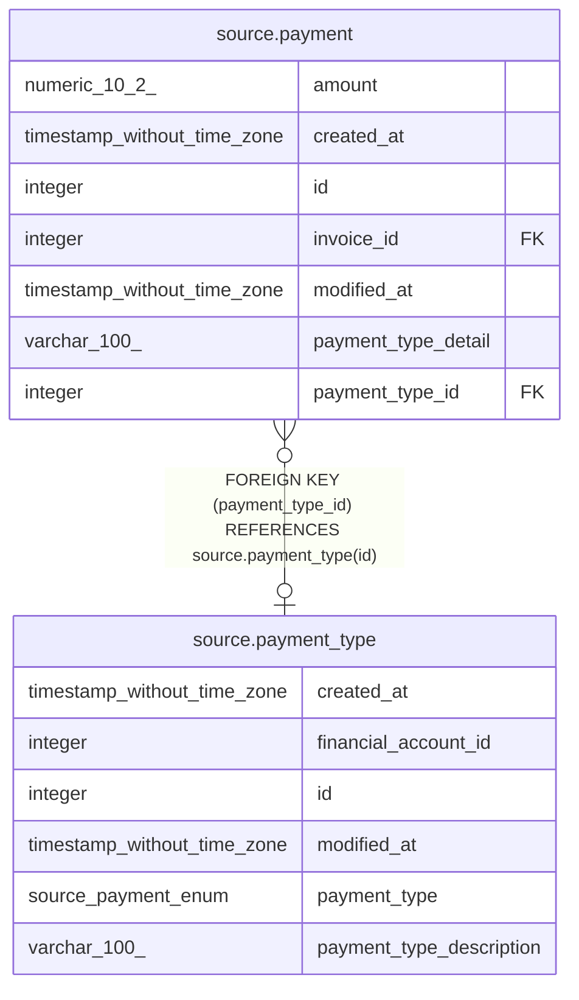

# source.payment_type

## Description

## Columns

| # | Name                     | Type                        | Default                                         | Nullable | Children                            | Parents | Comment |
| - | ------------------------ | --------------------------- | ----------------------------------------------- | -------- | ----------------------------------- | ------- | ------- |
| 1 | created_at               | timestamp without time zone | CURRENT_TIMESTAMP                               | true     |                                     |         |         |
| 2 | financial_account_id     | integer                     |                                                 | false    |                                     |         |         |
| 3 | id                       | integer                     | nextval('source.payment_type_id_seq'::regclass) | false    | [source.payment](source.payment.md) |         |         |
| 4 | modified_at              | timestamp without time zone | CURRENT_TIMESTAMP                               | true     |                                     |         |         |
| 5 | payment_type             | source.payment_enum         |                                                 | true     |                                     |         |         |
| 6 | payment_type_description | varchar(100)                |                                                 | true     |                                     |         |         |

## Constraints

| # | Name              | Type        | Definition       |
| - | ----------------- | ----------- | ---------------- |
| 1 | payment_type_pkey | PRIMARY KEY | PRIMARY KEY (id) |

## Indexes

| # | Name              | Definition                                                                    |
| - | ----------------- | ----------------------------------------------------------------------------- |
| 1 | payment_type_pkey | CREATE UNIQUE INDEX payment_type_pkey ON source.payment_type USING btree (id) |

## Relations

---

> Generated by [tbls](https://github.com/k1LoW/tbls)
