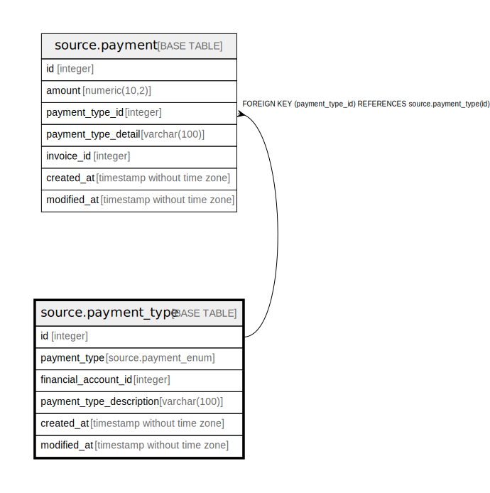

# source.payment_type

## Description

## Columns

| Name | Type | Default | Nullable | Children | Parents | Comment |
| ---- | ---- | ------- | -------- | -------- | ------- | ------- |
| id | integer | nextval('source.payment_type_id_seq'::regclass) | false | [source.payment](source.payment.md) |  |  |
| payment_type | source.payment_enum |  | true |  |  |  |
| financial_account_id | integer |  | false |  |  |  |
| payment_type_description | varchar(100) |  | true |  |  |  |
| created_at | timestamp without time zone | CURRENT_TIMESTAMP | true |  |  |  |
| modified_at | timestamp without time zone | CURRENT_TIMESTAMP | true |  |  |  |

## Constraints

| Name | Type | Definition |
| ---- | ---- | ---------- |
| payment_type_pkey | PRIMARY KEY | PRIMARY KEY (id) |

## Indexes

| Name | Definition |
| ---- | ---------- |
| payment_type_pkey | CREATE UNIQUE INDEX payment_type_pkey ON source.payment_type USING btree (id) |

## Relations

---

> Generated by [tbls](https://github.com/k1LoW/tbls)
