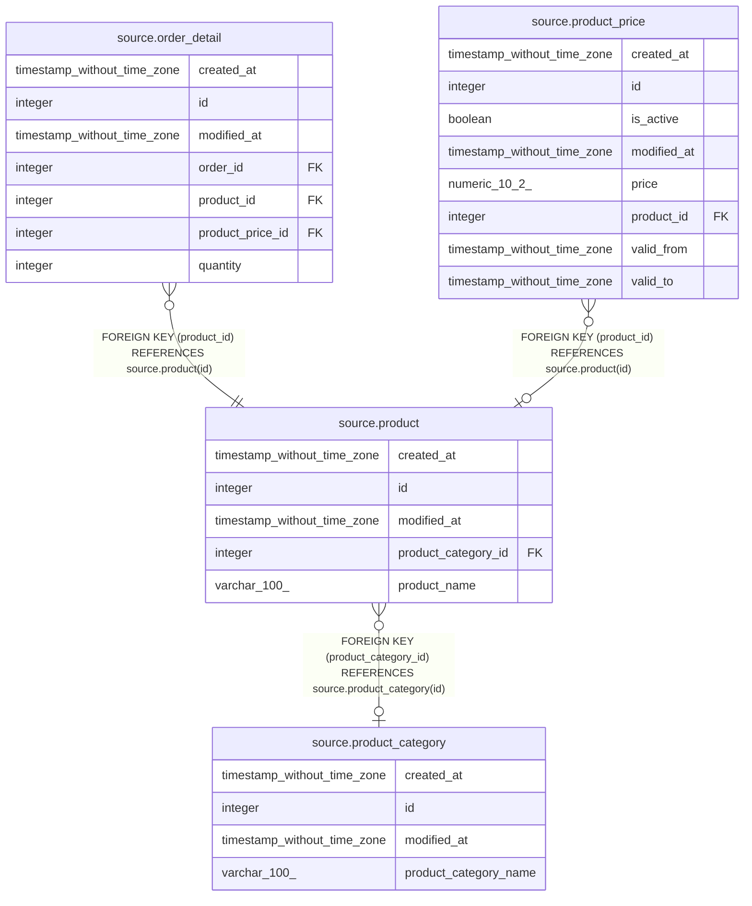

# source.product

## Description

## Columns

| # | Name                | Type                        | Default                                    | Nullable | Children                                                                                      | Parents                                               | Comment |
| - | ------------------- | --------------------------- | ------------------------------------------ | -------- | --------------------------------------------------------------------------------------------- | ----------------------------------------------------- | ------- |
| 1 | created_at          | timestamp without time zone | CURRENT_TIMESTAMP                          | true     |                                                                                               |                                                       |         |
| 2 | id                  | integer                     | nextval('source.product_id_seq'::regclass) | false    | [source.order_detail](source.order_detail.md) [source.product_price](source.product_price.md) |                                                       |         |
| 3 | modified_at         | timestamp without time zone | CURRENT_TIMESTAMP                          | true     |                                                                                               |                                                       |         |
| 4 | product_category_id | integer                     |                                            | true     |                                                                                               | [source.product_category](source.product_category.md) |         |
| 5 | product_name        | varchar(100)                |                                            | true     |                                                                                               |                                                       |         |

## Constraints

| # | Name                   | Type        | Definition                                                               |
| - | ---------------------- | ----------- | ------------------------------------------------------------------------ |
| 1 | fk_product_category_id | FOREIGN KEY | FOREIGN KEY (product_category_id) REFERENCES source.product_category(id) |
| 2 | product_pkey           | PRIMARY KEY | PRIMARY KEY (id)                                                         |

## Indexes

| # | Name         | Definition                                                          |
| - | ------------ | ------------------------------------------------------------------- |
| 1 | product_pkey | CREATE UNIQUE INDEX product_pkey ON source.product USING btree (id) |

## Relations

---

> Generated by [tbls](https://github.com/k1LoW/tbls)
