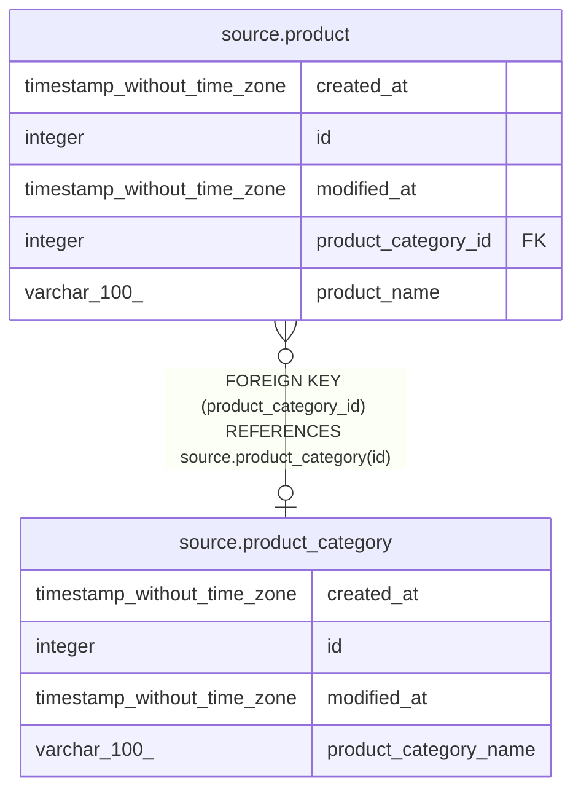

# source.product_category

## Description

## Columns

| # | Name                  | Type                        | Default                                             | Nullable | Children                            | Parents | Comment |
| - | --------------------- | --------------------------- | --------------------------------------------------- | -------- | ----------------------------------- | ------- | ------- |
| 1 | created_at            | timestamp without time zone | CURRENT_TIMESTAMP                                   | true     |                                     |         |         |
| 2 | id                    | integer                     | nextval('source.product_category_id_seq'::regclass) | false    | [source.product](source.product.md) |         |         |
| 3 | modified_at           | timestamp without time zone | CURRENT_TIMESTAMP                                   | true     |                                     |         |         |
| 4 | product_category_name | varchar(100)                |                                                     | true     |                                     |         |         |

## Constraints

| # | Name                  | Type        | Definition       |
| - | --------------------- | ----------- | ---------------- |
| 1 | product_category_pkey | PRIMARY KEY | PRIMARY KEY (id) |

## Indexes

| # | Name                  | Definition                                                                            |
| - | --------------------- | ------------------------------------------------------------------------------------- |
| 1 | product_category_pkey | CREATE UNIQUE INDEX product_category_pkey ON source.product_category USING btree (id) |

## Relations

---

> Generated by [tbls](https://github.com/k1LoW/tbls)
