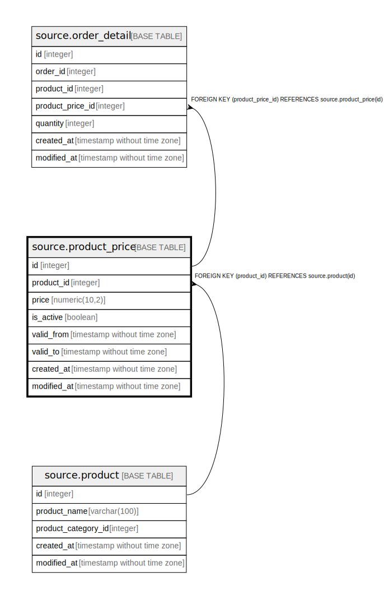

# source.product_price

## Description

## Columns

| Name | Type | Default | Nullable | Children | Parents | Comment |
| ---- | ---- | ------- | -------- | -------- | ------- | ------- |
| id | integer | nextval('source.product_price_id_seq'::regclass) | false | [source.order_detail](source.order_detail.md) |  |  |
| product_id | integer |  | true |  | [source.product](source.product.md) |  |
| price | numeric(10,2) |  | true |  |  |  |
| is_active | boolean | true | true |  |  |  |
| valid_from | timestamp without time zone | CURRENT_TIMESTAMP | true |  |  |  |
| valid_to | timestamp without time zone |  | true |  |  |  |
| created_at | timestamp without time zone | CURRENT_TIMESTAMP | true |  |  |  |
| modified_at | timestamp without time zone | CURRENT_TIMESTAMP | true |  |  |  |

## Constraints

| Name | Type | Definition |
| ---- | ---- | ---------- |
| fk_product_id | FOREIGN KEY | FOREIGN KEY (product_id) REFERENCES source.product(id) |
| product_price_pkey | PRIMARY KEY | PRIMARY KEY (id) |

## Indexes

| Name | Definition |
| ---- | ---------- |
| product_price_pkey | CREATE UNIQUE INDEX product_price_pkey ON source.product_price USING btree (id) |

## Relations

---

> Generated by [tbls](https://github.com/k1LoW/tbls)
