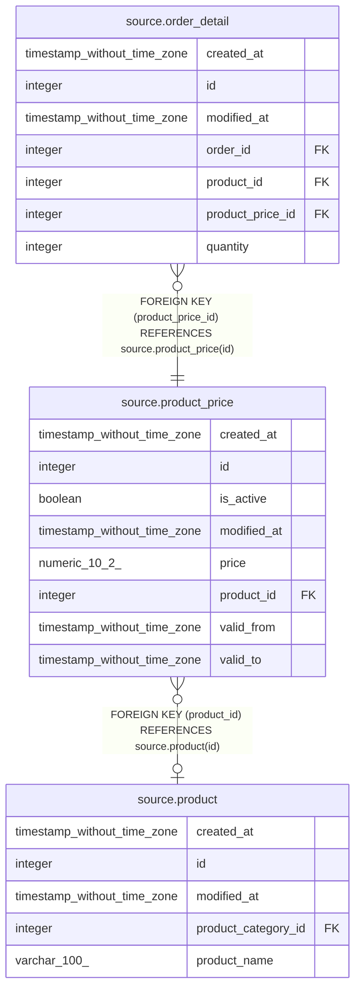

# source.product_price

## Description

## Columns

| # | Name        | Type                        | Default                                          | Nullable | Children                                      | Parents                             | Comment |
| - | ----------- | --------------------------- | ------------------------------------------------ | -------- | --------------------------------------------- | ----------------------------------- | ------- |
| 1 | created_at  | timestamp without time zone | CURRENT_TIMESTAMP                                | true     |                                               |                                     |         |
| 2 | id          | integer                     | nextval('source.product_price_id_seq'::regclass) | false    | [source.order_detail](source.order_detail.md) |                                     |         |
| 3 | is_active   | boolean                     | true                                             | true     |                                               |                                     |         |
| 4 | modified_at | timestamp without time zone | CURRENT_TIMESTAMP                                | true     |                                               |                                     |         |
| 5 | price       | numeric(10,2)               |                                                  | true     |                                               |                                     |         |
| 6 | product_id  | integer                     |                                                  | true     |                                               | [source.product](source.product.md) |         |
| 7 | valid_from  | timestamp without time zone | CURRENT_TIMESTAMP                                | true     |                                               |                                     |         |
| 8 | valid_to    | timestamp without time zone |                                                  | true     |                                               |                                     |         |

## Constraints

| # | Name               | Type        | Definition                                             |
| - | ------------------ | ----------- | ------------------------------------------------------ |
| 1 | fk_product_id      | FOREIGN KEY | FOREIGN KEY (product_id) REFERENCES source.product(id) |
| 2 | product_price_pkey | PRIMARY KEY | PRIMARY KEY (id)                                       |

## Indexes

| # | Name               | Definition                                                                      |
| - | ------------------ | ------------------------------------------------------------------------------- |
| 1 | product_price_pkey | CREATE UNIQUE INDEX product_price_pkey ON source.product_price USING btree (id) |

## Relations

---

> Generated by [tbls](https://github.com/k1LoW/tbls)
