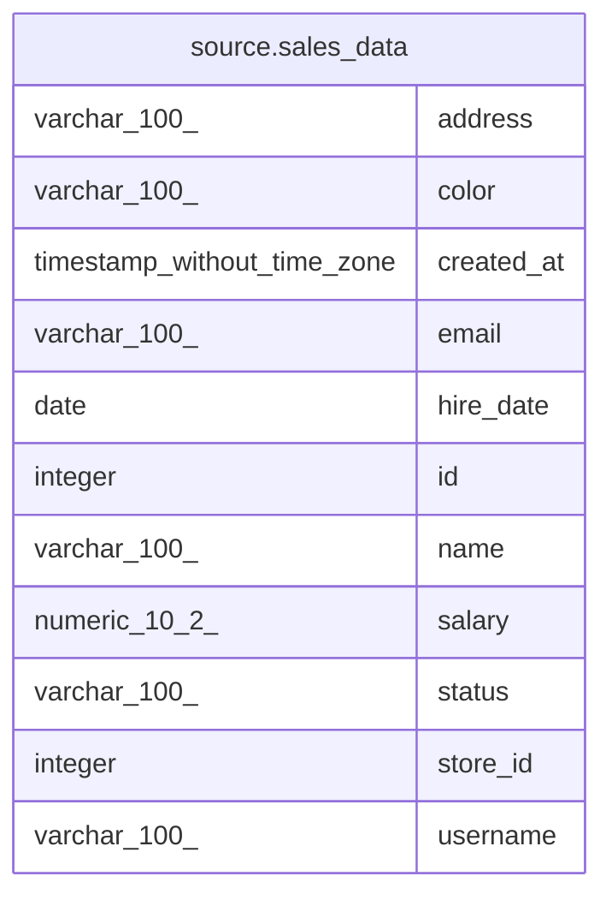

# source.sales_data

## Description

## Columns

| #  | Name       | Type                        | Default                                       | Nullable | Children | Parents | Comment |
| -- | ---------- | --------------------------- | --------------------------------------------- | -------- | -------- | ------- | ------- |
| 1  | address    | varchar(100)                |                                               | true     |          |         |         |
| 2  | color      | varchar(100)                |                                               | true     |          |         |         |
| 3  | created_at | timestamp without time zone | CURRENT_TIMESTAMP                             | true     |          |         |         |
| 4  | email      | varchar(100)                |                                               | true     |          |         |         |
| 5  | hire_date  | date                        |                                               | true     |          |         |         |
| 6  | id         | integer                     | nextval('source.sales_data_id_seq'::regclass) | false    |          |         |         |
| 7  | name       | varchar(100)                |                                               | true     |          |         |         |
| 8  | salary     | numeric(10,2)               |                                               | true     |          |         |         |
| 9  | status     | varchar(100)                |                                               | true     |          |         |         |
| 10 | store_id   | integer                     |                                               | true     |          |         |         |
| 11 | username   | varchar(100)                |                                               | true     |          |         |         |

## Constraints

| # | Name            | Type        | Definition       |
| - | --------------- | ----------- | ---------------- |
| 1 | sales_data_pkey | PRIMARY KEY | PRIMARY KEY (id) |

## Indexes

| # | Name            | Definition                                                                |
| - | --------------- | ------------------------------------------------------------------------- |
| 1 | sales_data_pkey | CREATE UNIQUE INDEX sales_data_pkey ON source.sales_data USING btree (id) |

## Relations

---

> Generated by [tbls](https://github.com/k1LoW/tbls)
