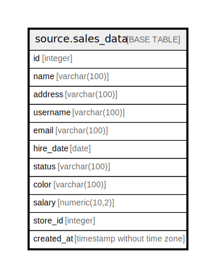

# source.sales_data

## Description

## Columns

| Name | Type | Default | Nullable | Children | Parents | Comment |
| ---- | ---- | ------- | -------- | -------- | ------- | ------- |
| id | integer | nextval('source.sales_data_id_seq'::regclass) | false |  |  |  |
| name | varchar(100) |  | true |  |  |  |
| address | varchar(100) |  | true |  |  |  |
| username | varchar(100) |  | true |  |  |  |
| email | varchar(100) |  | true |  |  |  |
| hire_date | date |  | true |  |  |  |
| status | varchar(100) |  | true |  |  |  |
| color | varchar(100) |  | true |  |  |  |
| salary | numeric(10,2) |  | true |  |  |  |
| store_id | integer |  | true |  |  |  |
| created_at | timestamp without time zone | CURRENT_TIMESTAMP | true |  |  |  |

## Constraints

| Name | Type | Definition |
| ---- | ---- | ---------- |
| sales_data_pkey | PRIMARY KEY | PRIMARY KEY (id) |

## Indexes

| Name | Definition |
| ---- | ---------- |
| sales_data_pkey | CREATE UNIQUE INDEX sales_data_pkey ON source.sales_data USING btree (id) |

## Relations

---

> Generated by [tbls](https://github.com/k1LoW/tbls)
