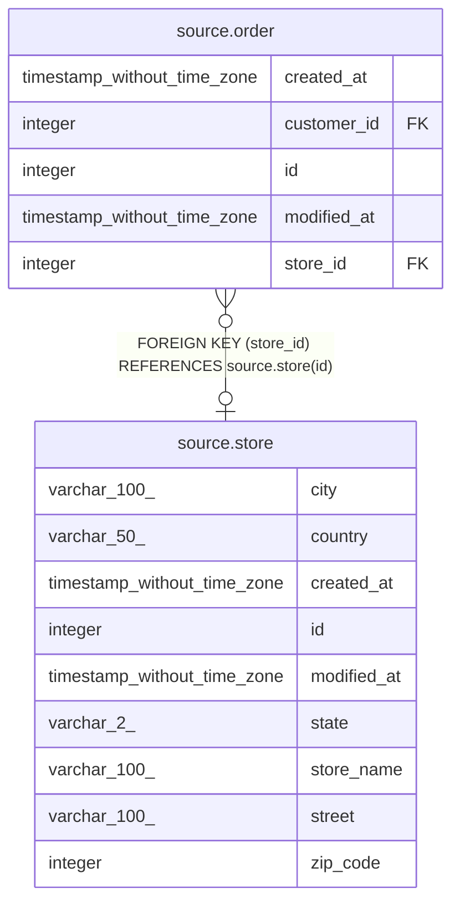

# source.store

## Description

## Columns

| # | Name        | Type                        | Default                                  | Nullable | Children                        | Parents | Comment |
| - | ----------- | --------------------------- | ---------------------------------------- | -------- | ------------------------------- | ------- | ------- |
| 1 | city        | varchar(100)                |                                          | true     |                                 |         |         |
| 2 | country     | varchar(50)                 |                                          | true     |                                 |         |         |
| 3 | created_at  | timestamp without time zone | CURRENT_TIMESTAMP                        | true     |                                 |         |         |
| 4 | id          | integer                     | nextval('source.store_id_seq'::regclass) | false    | [source.order](source.order.md) |         |         |
| 5 | modified_at | timestamp without time zone | CURRENT_TIMESTAMP                        | true     |                                 |         |         |
| 6 | state       | varchar(2)                  |                                          | true     |                                 |         |         |
| 7 | store_name  | varchar(100)                |                                          | true     |                                 |         |         |
| 8 | street      | varchar(100)                |                                          | true     |                                 |         |         |
| 9 | zip_code    | integer                     |                                          | true     |                                 |         |         |

## Constraints

| # | Name       | Type        | Definition       |
| - | ---------- | ----------- | ---------------- |
| 1 | store_pkey | PRIMARY KEY | PRIMARY KEY (id) |

## Indexes

| # | Name       | Definition                                                      |
| - | ---------- | --------------------------------------------------------------- |
| 1 | store_pkey | CREATE UNIQUE INDEX store_pkey ON source.store USING btree (id) |

## Relations

---

> Generated by [tbls](https://github.com/k1LoW/tbls)
